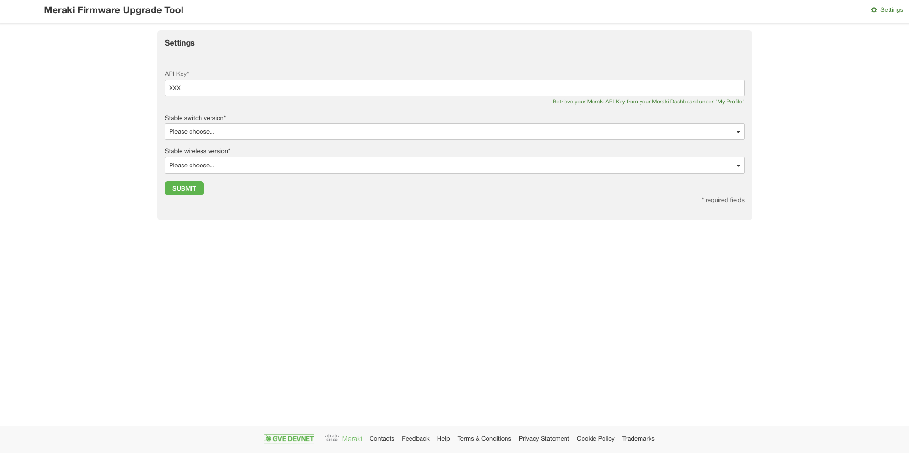
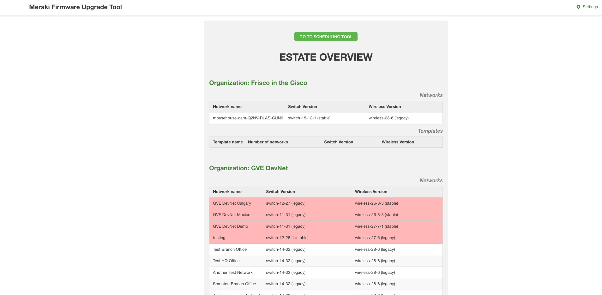
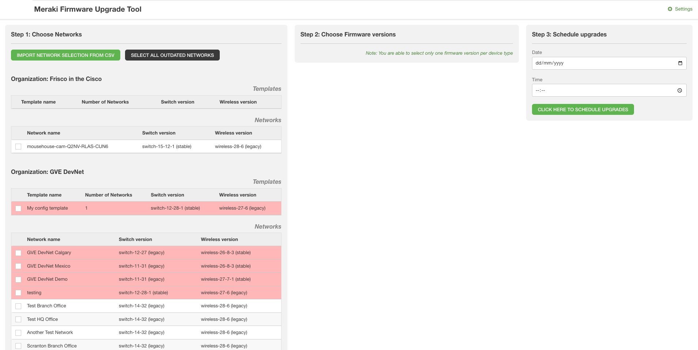
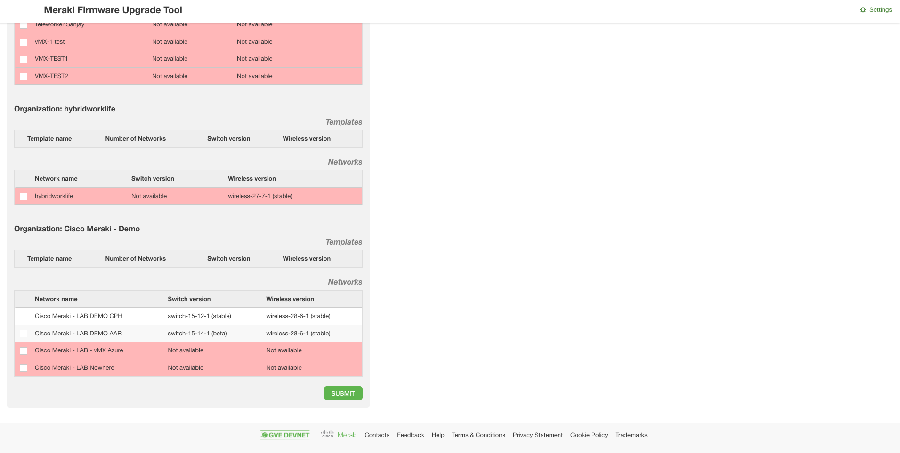
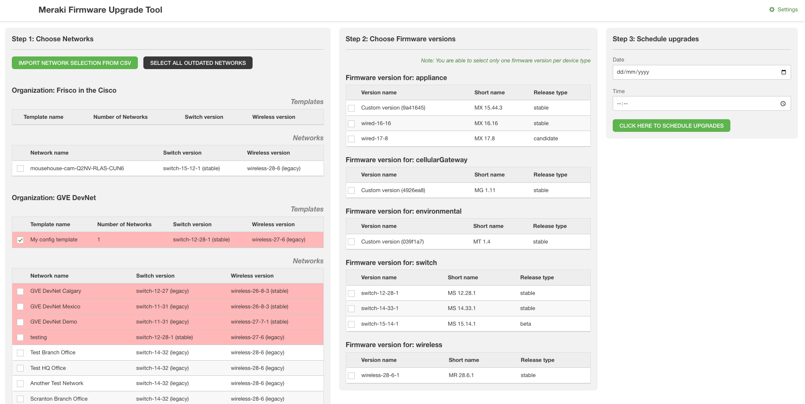
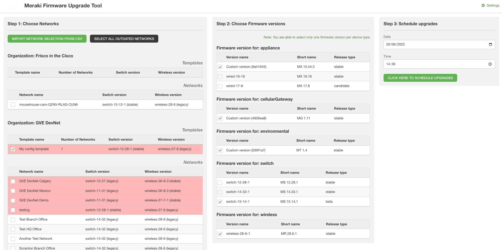

# GVE DevNet Meraki Firmware Upgrade Tool
This prototype allows its user to (1) consult available firmware versions in their environment, and (2) schedule a firmware upgrade for a certain time, to a certain software version per device type as present in their networks. Per network, the user can schedule a separate firmware upgrade.

## Contacts
* Stien Vanderhallen

## Solution Components
* Meraki
* Meraki REST API

## Installation/Configuration

The following commands are executed in the terminal.

1. Set up a Python virtual environment. Make sure Python 3 is installed in your environment, and if not, you may download Python [here](https://www.python.org/downloads/). 
Once Python 3 is installed in your environment, you can activate the virtual environment with the instructions found [here](https://docs.python.org/3/tutorial/venv.html). 

2. Access the created virtual environment folder

        $ cd your_venv

3. Clone this repository

        $ git clone https://github.com/gve-sw/gve_devnet_meraki_firmware_upgrade.git

4. Access the folder `gve_devnet_meraki_firmware_upgrade`

        $ cd gve_devnet_meraki_firmware_upgrade

5. Install the dependencies:

        $ pip install -r requirements.txt

## Usage
1. To launch the app, type the following command in your terminal:

        $ python3 app.py

2. To access the app, navigate in a browser to `localhost:5555`

# Workflow

0. On `localhost:5555/settings`, enter your Meraki API key. Obtain this key in the Meraki dashboard, under `My Profile > API access`. Click `Submit`.

1. On `localhost:5555`, you find the landing page of the prototype. Here, an overview of all organizations and networks or your Meraki API key are presented. All firmware versions deemed out of date (before the minimal version as confgured at `localhost:5555/settings`) will be marked in red.

2. Click `Go to scheduling tool`.

3. Land on the firmware upgrading page. Select all networks you want to upgrade. To make this easier, you can use the buttons at the top left to either (1) import a selection as downloaded from the Meraki dashboard, or (2) select all outdated networks. 

4. Click `Submit`

5. Consult the common firmware versions for the selected networks, and select the desired version to upgrade to (you have to select one version per device type).

6. Schedule a date and time for the upgrade, and click `Schedule firmware upgrades`.

# Screenshots

### LICENSE

Provided under Cisco Sample Code License, for details see [LICENSE](LICENSE.md)

### CODE_OF_CONDUCT

Our code of conduct is available [here](CODE_OF_CONDUCT.md)

### CONTRIBUTING

See our contributing guidelines [here](CONTRIBUTING.md)

#### DISCLAIMER:
<b>Please note:</b> This script is meant for demo purposes only. All tools/ scripts in this repo are released for use "AS IS" without any warranties of any kind, including, but not limited to their installation, use, or performance. Any use of these scripts and tools is at your own risk. There is no guarantee that they have been through thorough testing in a comparable environment and we are not responsible for any damage or data loss incurred with their use.
You are responsible for reviewing and testing any scripts you run thoroughly before use in any non-testing environment.

